# Music Babel

A music community app. Users can recommend songs, rate and comment on recommended songs, and also generate a random song. This app utlizes Spotify APIs and allows the user to link to their spotify account. Registeration and login is required to interact with the app in any way. Users can view recommendations and comments without being logged in, but these features are read only and no further features of the app are accessable or visable to non-members. A more indepth explanation of all of the features can be found below. Screenshots are included for visaul aid.

## Languages used

This app was built using the following coding languages and libraries 

-HTML
-CSS
-JavaScript
-React.js
-Node.JS
-Redux
-Redux Sagas
-Material UI
-Sweet Alerts
-PG
-SQL
-Google Fonts
-Axios
-Spotify APIs
-Filestack

#### Instructions

1. If you are an existing member you can log in with your username and password here. You can navigate the app as a guest but your access will be limited and features will be read only. The photo that appears at the login page is randomized and a different photo will appear every time a user enters the login page or refreshes the page

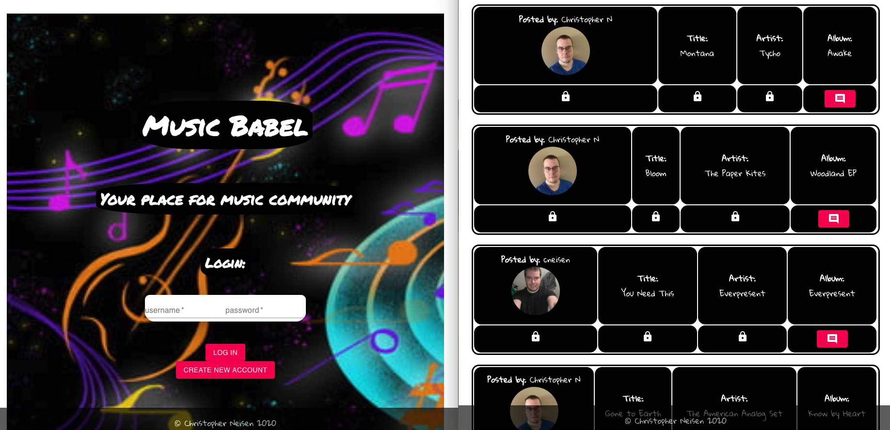

2. if you are a new user you can click on the "create new account" button to toggle to the sign up page. Here you can register. 

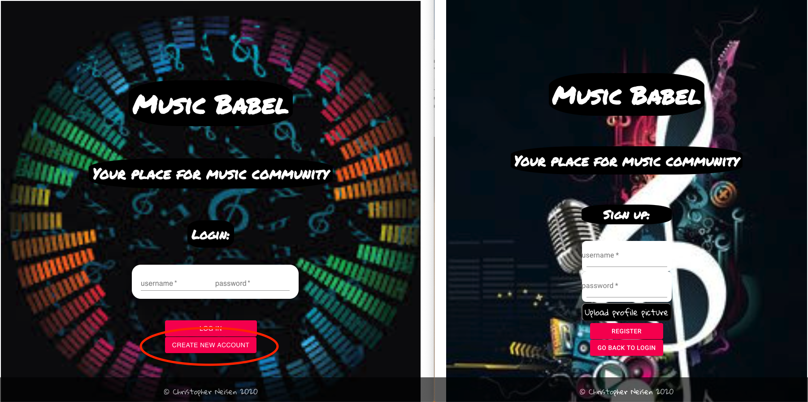

3. To register choose a username and password and select a profile picture. The profile picture is optional and will be replaced with a silhouette template if one is not choosen. When you click "upload profile picture" a user can either choose to upload a file from their computer or link to their facebook account to grab a photo from there. 

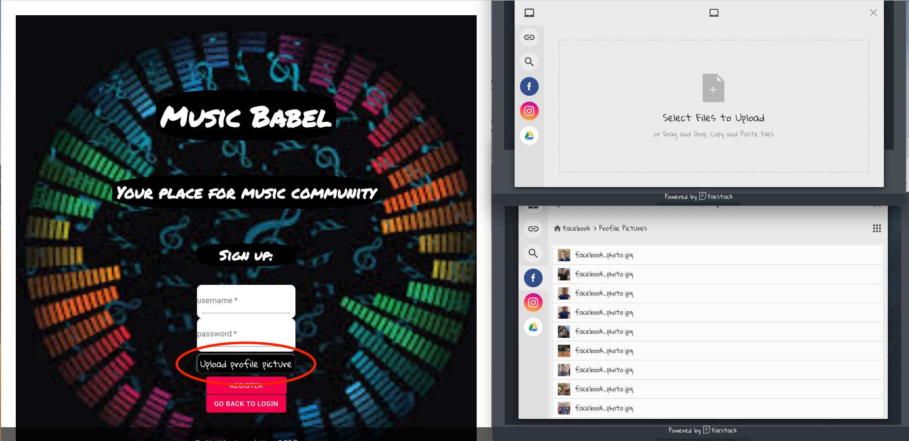

4. Once a user is logged in they will have access to new features which include a display of their name and profile picture on the upper left hand corner of their page. They will also see a "now playing" window that the user can toggle back and forth by pushing the "toggle window" button. Once a user links to their spotify account they will be able to see their current playing song in this window. To logout click the logout button to return to guest view.

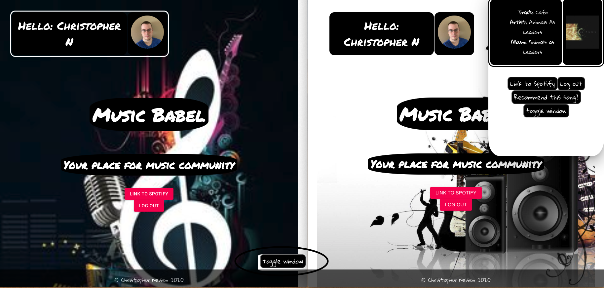

5. To link to your spotify account a user can click on the "link to spotify" button. This will route them to their spotify login where they can login to their spotify account. Upon successful login they will be routed back to Music Babel with their Spotify account linked. At this time even more features are available included the "Now Playing" window as well as "random song". Linking to spotify is not required to use this app, but it does allow additional functionality that would otherwise not be available.

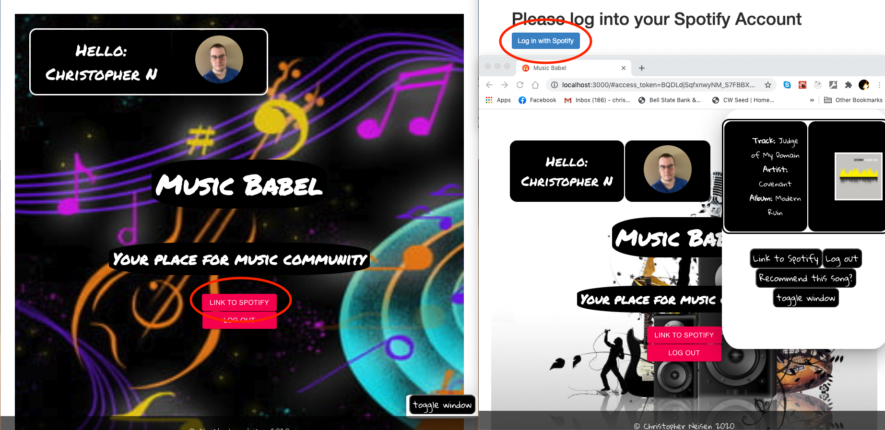

6. Now that you are logged in, you can recommend a song. Fill in the song, artist, and album below to make your recommendation. You can either push the "add new recommendation" button or push your enter key to add the recommendation. You will see a confirmation screen. Click "ok" to add your recommendation or "cancel" to cancel your action. You can see any recommendation you've made as well below as well as an edit or delete button for each one. These buttons are only visable for the recommendations you make as you can't edit or delete recommendations made by other users.

7. You can vote on any songs that are added by users, including songs that are not added by the current logged in user. Click on the star ratings listed to add your own vote. The average rating window will change into a drop down menu with a star button. Click on the drop down menu to add your own rating and click on the star button to confirm it. Your rating will get added to all the other ratings and the average rating is recalculated and shown on the average rating display.

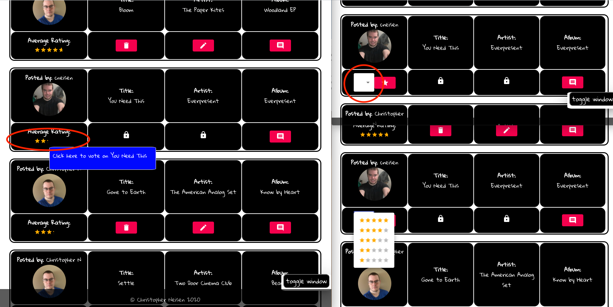

8. To delete a recommendation click on the trash icon for your listed recommendation. A confirmation window will pop up. Clicking "ok" will delete it. Clicking "cancel" will cancel the request to delete.

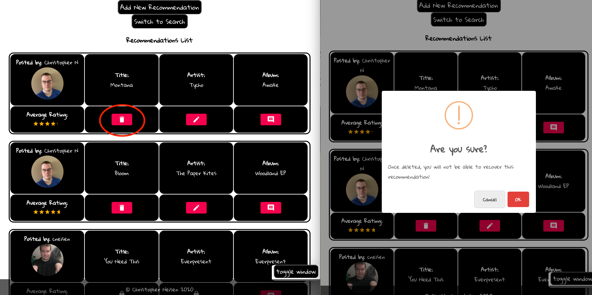

9. To edit a song click on the "pen" icon. A pop up window will appear on the left hand bottom corner. Here you can make your changes. You can either click the "edit recommendation" button or push your enter key to save your changes. Push "go back" to close the window without saving your changes.

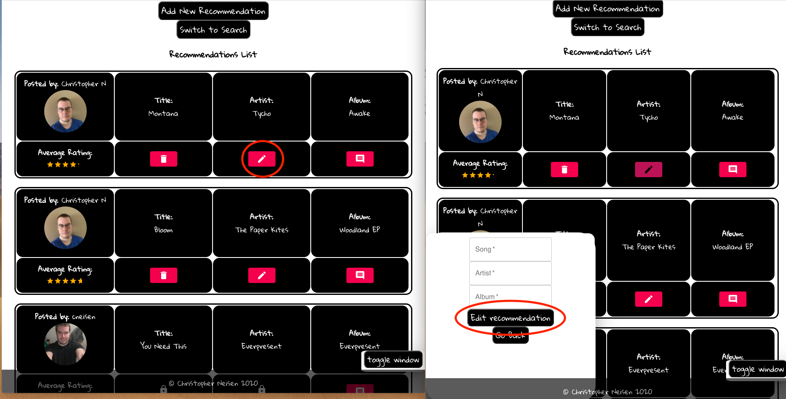

10. Click the comment icon to view comments. Here you can also add your own comments if you are logged in. Either click "comment" or push the enter key to add your comment. You can push "go back" to close the window when you are done.

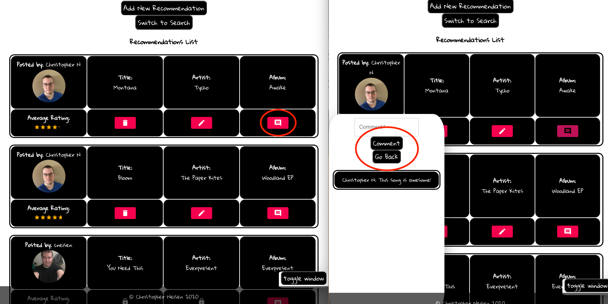

11. Only 5 recommendations show at a time. Click next or previous to switch to the next or previous page.

12. You can switch to search view by clicking "switch to search". Here you can type your search query in the text box and either click "search" or push the enter key. This will search any song, artist, or album that matches the query and display them below. To go back click "go back" to return to normal view

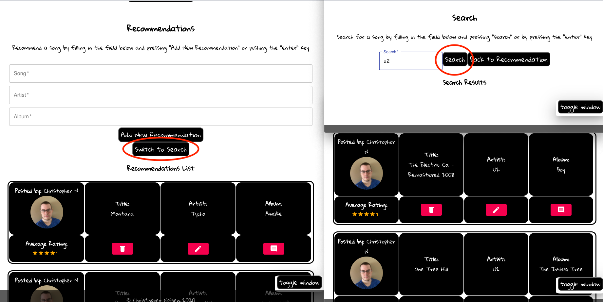

13. You can choose to recommend any song you are listening to currently at any time. In the now playing toggle window click the "recommend this song" button to cause a confirmation page to show up. Clicking "ok" will add it to the recommendation list. Clicking "cancel" will cancel the action.

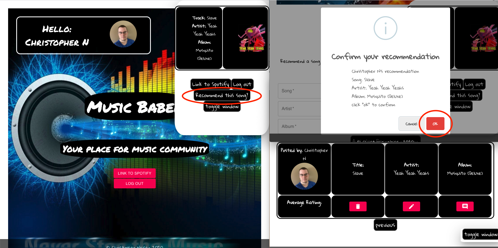

14. To generate a random song click the "go to random song" button. Here you can click "generate random song" and a random song from spotify's entire catalog is generated. The random song that is generated could be anything. The user must be linked to spotify in order to use this feature. You can also view 20 artists below that are similar to the random generated artist to give you an idea of the style of that paticular artist.

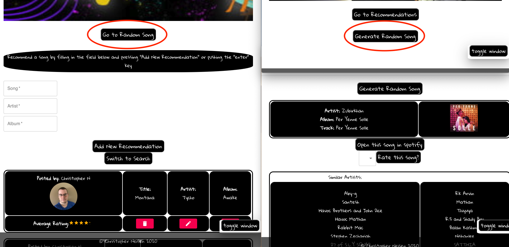

15. You can click the "open in spotify" button to play any song that you randomly generate. Be aware this feature only works if you are not already playing a song in spotify. 

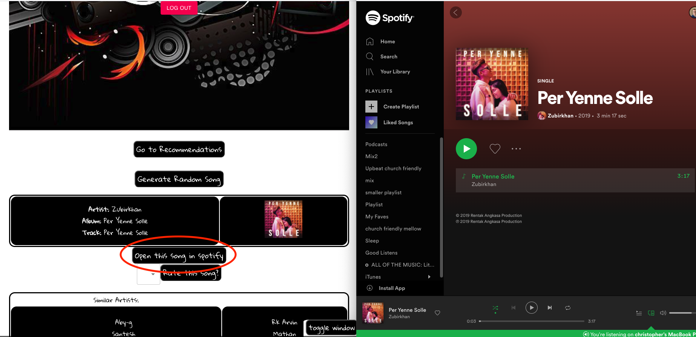

16. You can rate any randomly generated song. Any songs rated a 1 or 2 stars will be skipped and a new song will be generated in it's place. Any song rated 3 to 5 stars will be added to the recommendation page with the coorasponding rating from the user.

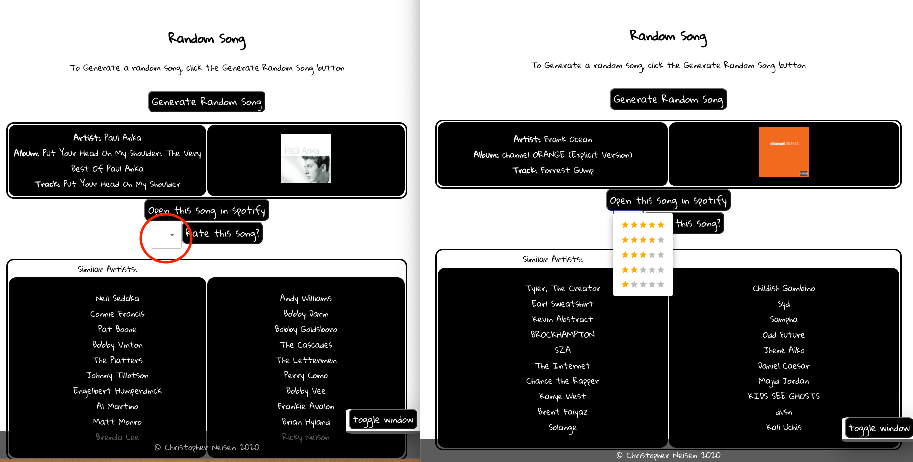